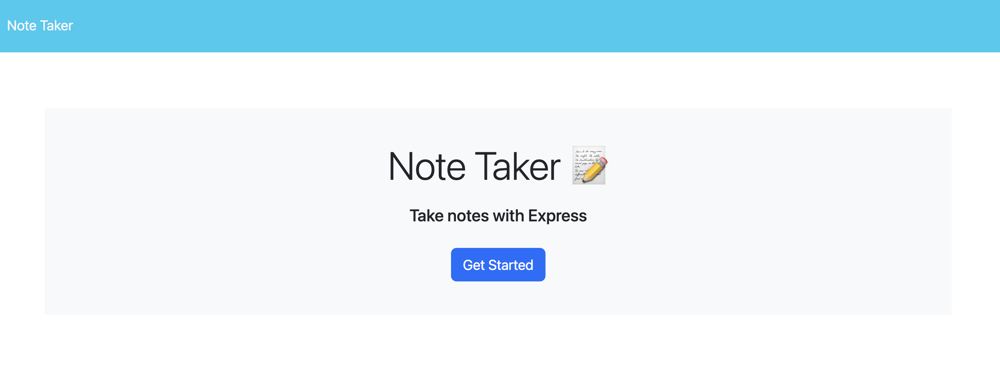
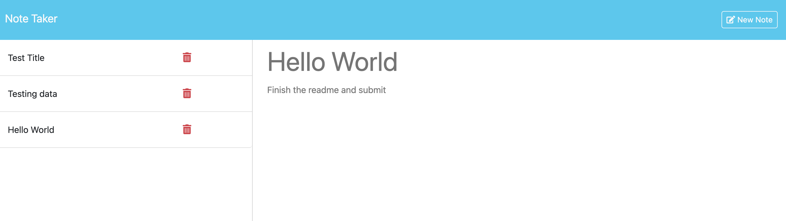

# VS-Notes-Keeper

## Description
VS-Notes-Keeper is a node js web application allowing users to create and delete new notes from the front end. This application handles all the user requests as API requests. The application was developed using server-side technologies like Node.js and Express.js and deployed on the Heroku platform. 

## Installation

To run or execute the application, one must have node installed in the system and other supporting packages like express.js

Follow the guidelines in the given link to install Node.js: https://nodejs.org/en/learn/getting-started/how-to-install-nodejs, 

Follow the guidelines in the given link to install express.js: https://expressjs.com/en/starter/installing.html 

## Usage

To access the webpage, use the below link  https://vs-notes-keeper-b09b3efbcb78.herokuapp.com/

The application source code can be accessed using the given link https://github.com/Vigneshwarie/VS-Notes-Keeper

One can download the source code from the above link. To use this application, one must install both node.js and express.js, as mentioned in the installation section. Once installed, navigate to the application folder and run the server.js file in the integrated terminal on vscode. Use the command below to the file,

application-folder> node server.js

The application can also be excuted using command, npm start

On successful installation and execution, the application will notify the user with a message stating the server it runs on. Navigate to the browser and type http://localhost:3001/, which will display the welcome page as below. 

On click of the button Getting started, it navigate the user to actual notes keeper web page displayed as below. 

The left side of the application displays the existing notes, and the right-hand side section accepts user inputs for new notes. Once the user enters the title and the text, the data can be saved with the save button on the top-right corner. Upon saving, the data is displayed on the left-hand side. The notes are rendered on the right-hand pane when clicking on the existing notes. Notes can also be deleted using the delete icon.

## Credits

https://developer.mozilla.org/en-US/docs/Web/JavaScript/Reference/Global_Objects/Array/filter

## License

Please refer to the LICENSE in the repo.
